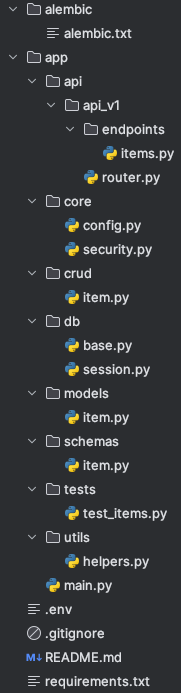

# FastAPI Folder Structure

This repository provides a clean and modular folder structure template for building FastAPI applications. It’s organized to help developers quickly set up, understand, and expand a FastAPI-based project. Ideal for scalable APIs with features such as database management, authentication, and organized routes.

## 📁 Project Structure Overview

### Folder Details

* **app/main.py**: The main entry point. Initializes the FastAPI instance, includes routers, and configures middleware.
* **app/core/**: Contains configuration (**config.py**) and security (**security.py**) settings.
* **app/api/**: Organized API versions (**api_v1**) with modular endpoint files.
* **app/models/**: SQLAlchemy models defining database schemas.
* **app/schemas/**: Pydantic schemas for request validation.
* **app/crud/**: CRUD logic for database operations.
* **app/db/**: Database session and metadata configuration.
* **app/tests/**: Test suite for unit and integration tests using pytest.
* **app/utils/**: Helper functions used across the project.

## 🚀 Getting Started

**Clone the repository**

* git clone https://github.com/devabdurasul/fastapi-project-structure.git
* cd fastapi_project_structure

## 🔧 Key Features

* Modular structure for scalable FastAPI applications

## 📝 License

This repository is open-sourced and available under the MIT License.

--------------------------------------------------------------------------------------------------------------------------

Feel free to customize this to better reflect any unique aspects of your setup!